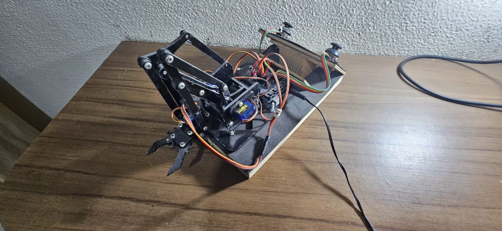
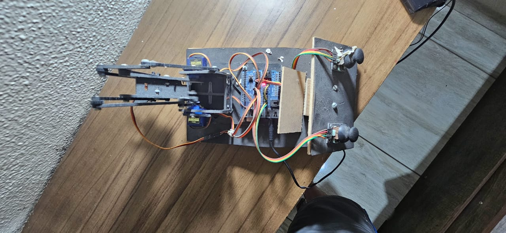
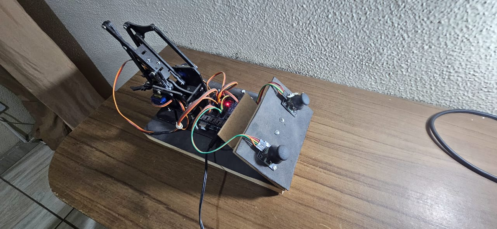

# 🤖 Projeto: Braço Robótico

## 🔍 Sobre o Projeto
Este projeto apresenta um **braço robótico controlado por joysticks**, desenvolvido com **Arduino Leonardo** e **servo motores**.  
O objetivo é demonstrar, de forma prática e interativa, **como sinais analógicos podem ser utilizados para controlar movimentos robóticos**, incentivando o interesse por **robótica e automação**.

---

## ⚙️ Funcionamento
O sistema utiliza **dois módulos de joystick**, cada um com **dois potenciômetros** e **um botão (não utilizado)**.  
Cada **potenciômetro controla um servo motor**, permitindo movimentar o braço robótico em **quatro eixos**:

- 🎮 Joystick 1:
  - Eixo X → Movimento do ombro  
  - Eixo Y → Movimento do cotovelo  

- 🎮 Joystick 2:
  - Eixo X → Movimento do punho  
  - Eixo Y → Movimento da garra  

Os sinais dos potenciômetros são lidos pelo **Arduino Leonardo**, que envia comandos para os **4 servo motores** conectados a um **servo shield**.  
O controle é **manual e em tempo real**, simulando movimentos humanos básicos de um braço.

---

## 🧩 Componentes Utilizados
- 1x **Arduino Leonardo**  
- 1x **Shield de Servo Motores**  
- 4x **Servo Motores SG90**  
- 2x **Módulos de Joystick** (com 2 potenciômetros e 1 botão cada)  
- Jumpers e fios de conexão  
- Estrutura física do braço robótico

---

## ⚡ Alimentação
O sistema é alimentado diretamente via **porta USB** do Arduino ou através de uma **fonte externa 5V**, dependendo da corrente necessária pelos servos.

---

## 🎯 Objetivo Educacional
O projeto tem como meta **introduzir conceitos de eletrônica, controle analógico e robótica**.  
Ele ajuda os estudantes a entenderem:
- Como um **potenciômetro** gera sinais analógicos;
- Como um **Arduino interpreta e converte esses sinais em movimento**;
- A importância de **mapear e limitar valores** para controle preciso.

---

## 📸 Galeria

  
  
  

---

## 🎥 Demonstração em Vídeo
🎬 [Clique aqui para assistir ao vídeo do projeto](video.mp4)

---

## 💬 Conclusão
O **Braço Robótico com Joysticks** demonstra, de maneira simples e divertida, como **a robótica e a programação podem trabalhar juntas** para criar sistemas controlados e funcionais.  
É uma excelente atividade para **introduzir crianças e iniciantes** ao mundo da **automação e da eletrônica aplicada**.

---

## 👨‍💻 Autores
Projeto desenvolvido por **Mateus Santos**, com fins **educacionais e demonstrativos**.