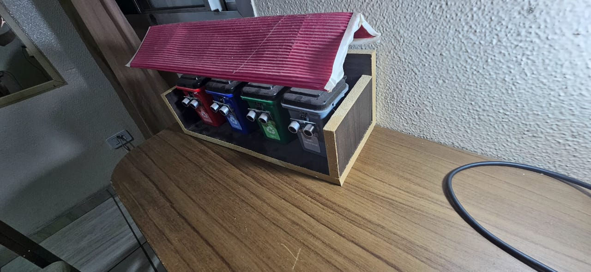
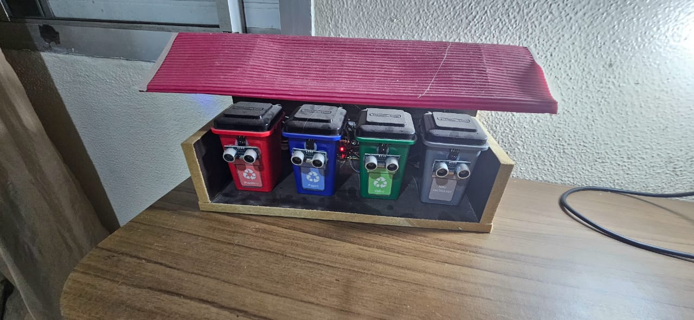
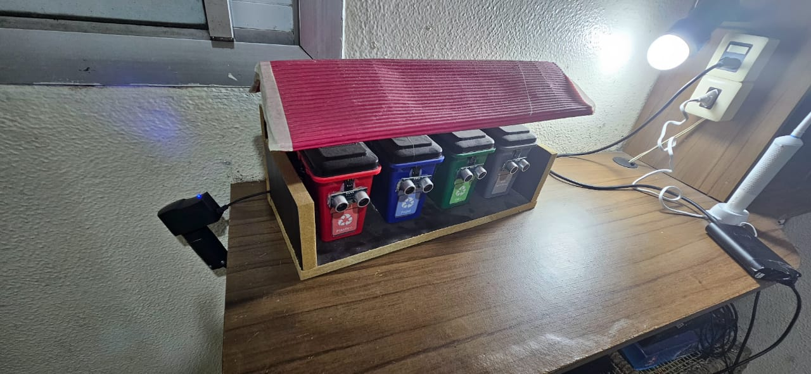

# ♻️ Projeto: Lixeiras Inteligentes com Arduino

## 🌱 Sobre o Projeto
Este projeto foi desenvolvido para uma **apresentação escolar voltada para crianças**, com o objetivo de **incentivar boas práticas de reciclagem** por meio da tecnologia.  
Foram criadas **4 lixeiras automatizadas**, cada uma representando um tipo de resíduo (metal, plástico, papel e orgânico).  
O sistema utiliza **sensores e servo motores** controlados por um **Arduino**, tornando o aprendizado sobre reciclagem mais divertido e interativo.

---

## ⚙️ Funcionamento
- Cada lixeira possui um **sensor ultrassônico** que detecta a aproximação da mão.  
- Ao detectar o movimento, o **servo motor abre a tampa** automaticamente.  
- Após alguns segundos, a tampa **fecha sozinha**.  
- As lixeiras são **alimentadas diretamente pela tomada**, com um adaptador apropriado.  

---

## 🔋 Componentes Utilizados
- 1x Placa **Arduino Uno**  
- 4x **Sensores Ultrassônicos HC-SR04**  
- 4x **Servo Motores SG90**  
- 4x **Lixeiras plásticas**  
- 1x **Fonte de alimentação** (adaptador 5V)  
- Fios jumpers, resistores e materiais de montagem  

---

## 🧠 Objetivo Educacional
O projeto busca **ensinar conceitos de reciclagem e sustentabilidade** de forma prática, unindo **tecnologia e consciência ambiental**.  
Crianças aprendem sobre:
- A separação correta do lixo;
- A importância de reduzir e reutilizar materiais;
- Como a eletrônica pode ajudar o meio ambiente.

---

## 🎥 Mídias do Projeto
📸 Fotos do protótipo:
-   
-   
- 

🎬 Vídeo de demonstração:
- 🎬 [Clique aqui para assistir ao vídeo de demonstração](video.mp4)

---

## 💬 Conclusão
As **Lixeiras Inteligentes** mostram como a tecnologia pode ser usada de forma criativa e educativa para promover **hábitos sustentáveis** desde cedo.  
O projeto incentiva a **curiosidade das crianças** e demonstra o poder do **Arduino** como ferramenta de aprendizado.

---

## 👨‍💻 Autores
Projeto desenvolvido por **Mateus Santos**, para fins **educacionais e de conscientização ambiental**.